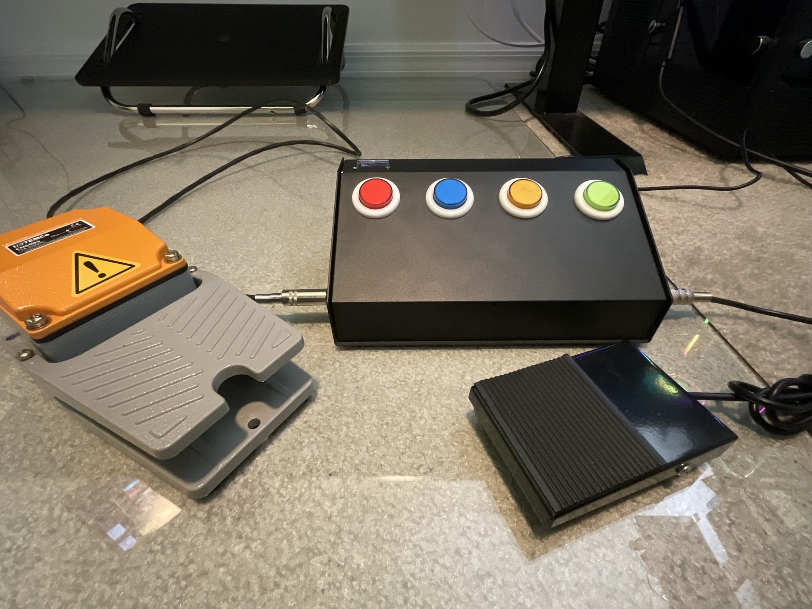
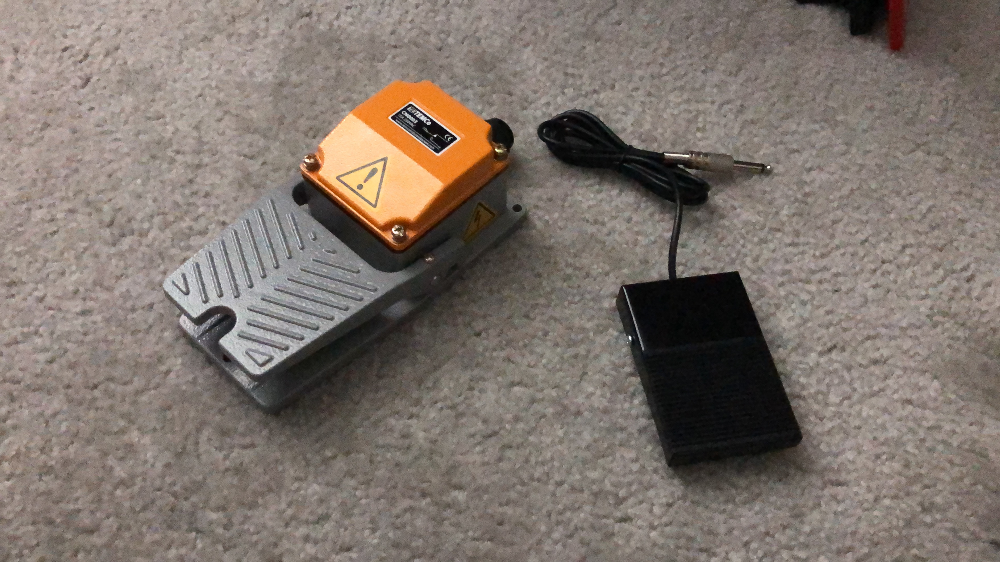
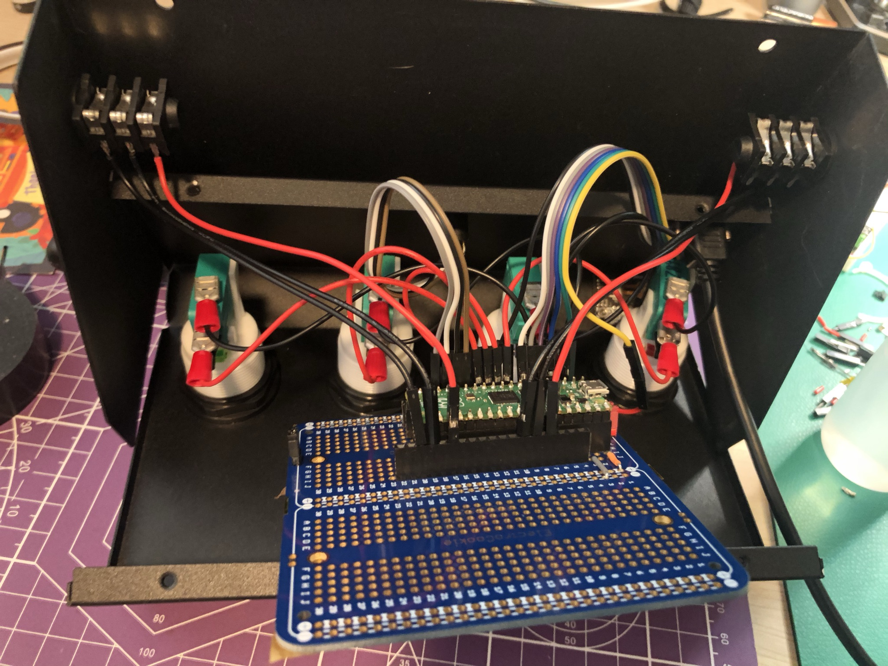
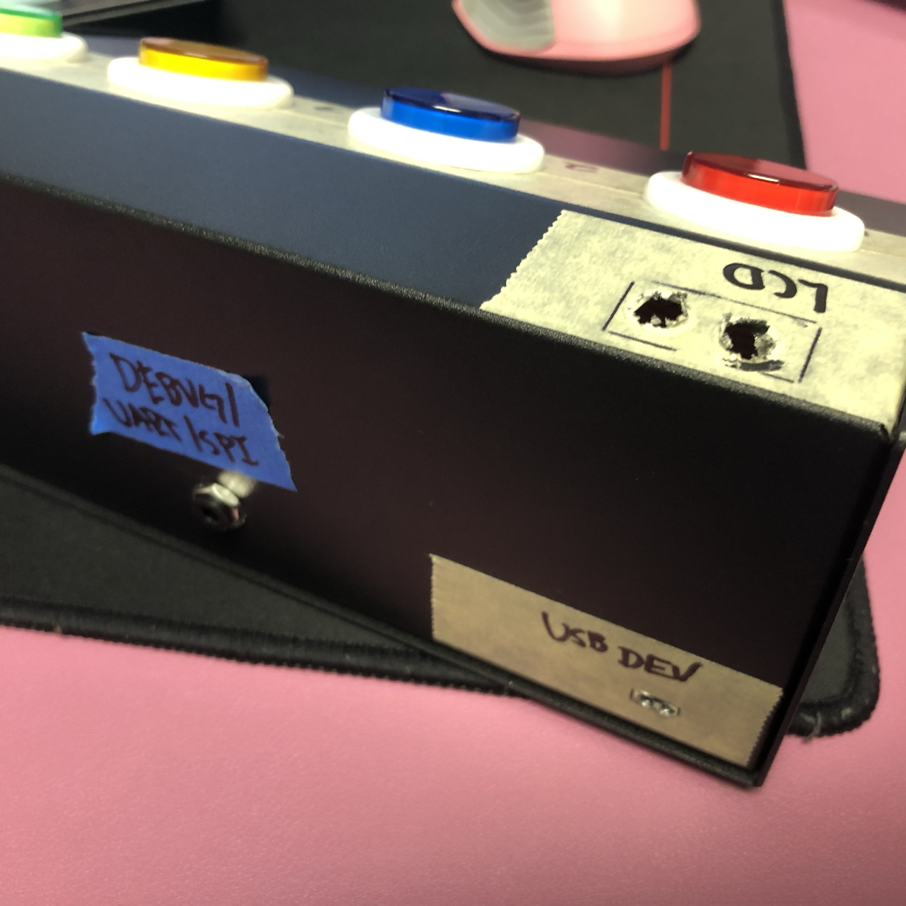
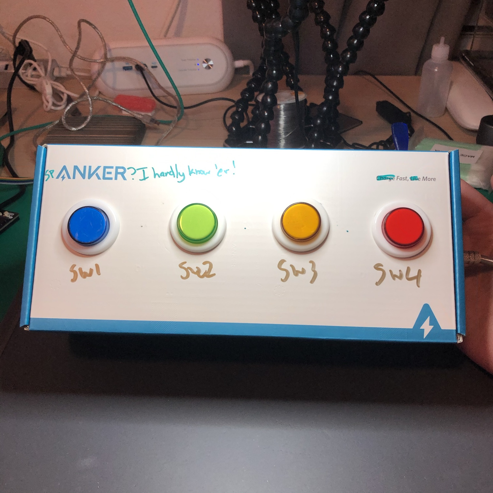

# 🦶🏻⌨️ cmdwtf.Kickboard
A CircuitPython project on a RP2040 that allows a foot-friendly array of buttons and switches to act as a USB keyboard. Think of it as a quite watered down variation on a StreamDeck or the sort.

## 🌄 Photos

  
_A short video of when I was tinkering with the code and testing inputs._

  
_The finished prototype._

  
_Pedals._

  
_A peek under the hood._

  
_The case mid being cut out._

  
_An early proof of concept in a random cardboard box._

## ⚒️🔍 Sourcing Parts
Since this was a one-off project, I didn't keep track exactly of the parts and bits I used, so here's my best attempt at providing a way for you to replicate this. Please note that the amazon links are affiliate links!

- Controller: [Raspberry Pi Pico RP2040](https://www.adafruit.com/product/4864)
- Heavy duty foot switch: [TEMCo Heavy Duty Foot Switch CN0003](https://www.amazon.com/gp/product/B00EF9D2DY?ie=UTF8&psc=1&linkCode=ll1&tag=cmd0ed-20&linkId=7f0021d9e80712f2afc129aec0984af1&language=en_US&ref_=as_li_ss_tl)
- Alternate foot switch: [Sparkfun Foot Pedal Switch](https://www.sparkfun.com/products/11192)
- Mode buttons: [Arcade Buttons](https://www.amazon.com/EG-STARTS-Arcade-Buttons-Multicade/dp/B01M0XPWGG?&linkCode=ll1&tag=cmd0ed-20&linkId=893dd811eadaf1b28924fe3e9bf02214&language=en_US&ref_=as_li_ss_tl) N.B.: _These aren't exactly what I used, I had some buttons I had bought from a local store. However, these are *very* similar._
- Jacks for foot pedals: [Jacks](https://www.amazon.com/GLS-Audio-Jacks-Female-Panel/dp/B003HLW14W?&linkCode=ll1&tag=cmd0ed-20&linkId=17594ace505ab11792d19a8bd42c0ba0&language=en_US&ref_=as_li_ss_tl) N.B.: _Like above, I had some I purchased from a local store, but these are similar._
- USB Panel mount: [Cable](https://www.adafruit.com/product/3258)
- Display: [1.14" Color TFT](https://www.adafruit.com/product/4383)
- Case: The link is gone, but I found it on eBay. There's lots of sellers from China & Hong Kong that sell all sorts of metal enclosures that would work. [Here's a link](https://www.ebay.com/itm/254669390727) to a random one that looks very similar to what I got.

## 🔰 Project State
The code here is definitely a quite bespoke for my setup, but it has dreams of being broken out and cleaned up one day. For now, it's likely best used as inspiration should you decide to duplicate my efforts in some way. Feel free to ask questions or suggest improvements, though!

## 💡 Inspiration
I needed a third hand. I found myself often wanting an extra ability to press a keyboard button or mouse click while I was working on hardware where both of my hands were tied up. I figured my feet were free, so why not use a foot pedal to work as a keyboard press or mouse click.

This project is the quick and dirty implementation of exactly that.

## 📝 License
PROJECT is [licensed](./LICENSE) under the Zero-Clause BSD License (SPDX-License-Identifier: 0BSD).

Copyright © 2021 [Chris March Dailey](https://cmd.wtf)

Permission to use, copy, modify, and/or distribute this software for any purpose with or without fee is hereby granted.

THE SOFTWARE IS PROVIDED "AS IS" AND THE AUTHOR DISCLAIMS ALL WARRANTIES WITH REGARD TO THIS SOFTWARE INCLUDING ALL IMPLIED WARRANTIES OF MERCHANTABILITY AND FITNESS. IN NO EVENT SHALL THE AUTHOR BE LIABLE FOR ANY SPECIAL, DIRECT, INDIRECT, OR CONSEQUENTIAL DAMAGES OR ANY DAMAGES WHATSOEVER RESULTING FROM LOSS OF USE, DATA OR PROFITS, WHETHER IN AN ACTION OF CONTRACT, NEGLIGENCE OR OTHER TORTIOUS ACTION, ARISING OUT OF OR IN CONNECTION WITH THE USE OR PERFORMANCE OF THIS SOFTWARE.
